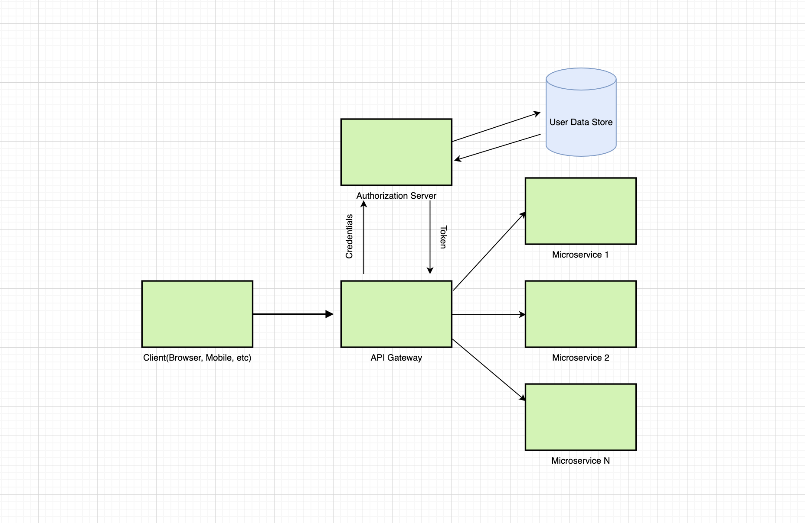

# 同一个世界，同一个梦想

- 通过docker-compose 初始化 nacos 数据库和表结构

## 服务依赖中间

服务依赖的中间价通过docker-compose 来启动

> docker-compose --compatibility up -d

A client makes a request to some secured resource with no authorization. 
API Gateway rejects it and redirects the user to 
the Authorization Server to authorize himself in the system, 
get all required grants and then make the request again 
with these grants to receive information from that secured resource.

## 组织结构

- lakers-auth Oauth2认证服务，负责对登录用户进行认证

- lakers-gateway 网关: 负责请求转发和鉴权功能

- lakers-family 用户服务

## 服务参考

<https://github.com/igorkosandyak/spring-cloud-demo>

